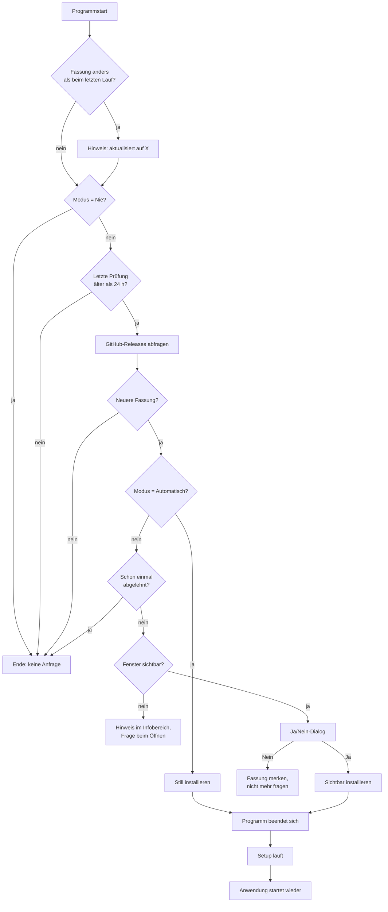

# Der Updater, zum Nachbauen

Wie Audio Mirror sich selbst aktualisiert — Aufbau, Entscheidungen und die Fallstricke, die
unterwegs auftraten. Gedacht als Bauanleitung für eine andere Windows-Anwendung.

Kurzfassung: die Anwendung fragt die GitHub-Releases-Schnittstelle ihres eigenen Repositorys ab,
vergleicht die Versionsnummer, lädt bei Bedarf das Setup und startet es — je nach Einstellung nach
Rückfrage sichtbar oder ohne jedes Zutun still, mit anschließendem Neustart der Anwendung. Kein
Server, kein Dienst, keine Bibliothek.

---

## 1. Der Ablauf



## 2. Die Bausteine

| Datei | Aufgabe |
|---|---|
| [`UpdateChecker.cs`](../UpdateChecker.cs) | Alles Netzseitige: abfragen, vergleichen, herunterladen, Setup starten. Kennt keine Oberfläche. |
| [`Ui/SettingsPage.cs`](../Ui/SettingsPage.cs) | Der Einstellungen-Teil: drei Modi, „Jetzt suchen", Statuszeile. Löst ein Ereignis aus, wenn etwas gefunden wurde. |
| [`Ui/MainForm.cs`](../Ui/MainForm.cs) | Entscheidet, was mit dem Fund geschieht. Nur hier gibt es ein Fenster für die Rückfrage und die Möglichkeit, sich zu beenden. |
| [`AppSettings.cs`](../AppSettings.cs) | Vier gespeicherte Felder (siehe §7). |
| [`setup/AudioMirror.iss`](../setup/AudioMirror.iss) | Inno Setup: nimmt die Neustart-Anweisung entgegen und überspringt beim Aktualisieren die Assistentenseiten. |

Die Trennung ist Absicht: **die Netzschicht weiß nichts von Fenstern, die Oberfläche weiß nichts
von HTTP.** Das Hauptfenster ist die einzige Stelle, an der beides zusammenkommt — weil nur es
fragen *und* das Programm beenden kann.

---

## 3. Prüfen

### Die Abfrage

```csharp
private const string LatestUrl =
    "https://api.github.com/repos/BENUTZER/REPO/releases?per_page=10";
```

Bewusst `releases`, nicht `releases/latest`: so lassen sich Entwürfe und Vorabfassungen selbst
aussortieren, statt sich darauf zu verlassen, was GitHub für „latest" hält.

```csharp
using var client = new HttpClient { Timeout = TimeSpan.FromSeconds(15) };
client.DefaultRequestHeaders.UserAgent.Add(new ProductInfoHeaderValue("MeineApp", CurrentVersion.ToString()));
client.DefaultRequestHeaders.Accept.Add(new MediaTypeWithQualityHeaderValue("application/vnd.github+json"));

string json = await client.GetStringAsync(LatestUrl, token).ConfigureAwait(false);
```

Ein `User-Agent` ist bei der GitHub-Schnittstelle **Pflicht** — ohne ihn kommt 403 zurück. Es
werden keinerlei Daten über den Rechner mitgeschickt; die eigene Versionsnummer im User-Agent ist
alles.

Kein Token, also **60 Anfragen pro Stunde und IP**. Bei einer Prüfung pro Tag völlig unkritisch,
aber es ist der Grund, warum es überhaupt ein Mindestfenster gibt (§3.3).

### Auswahl und Versionsvergleich

Über alle Einträge laufen und den höchsten nehmen, der besser ist als die eigene Fassung:

```csharp
UpdateInfo? best = null;
Version bestVersion = CurrentVersion;

foreach (JsonElement release in document.RootElement.EnumerateArray())
{
    if (release.TryGetProperty("draft", out var draft) && draft.GetBoolean()) continue;
    if (release.TryGetProperty("prerelease", out var pre) && pre.GetBoolean()) continue;

    Version version = ParseVersion(release.GetProperty("tag_name").GetString() ?? "");
    if (version <= bestVersion) continue;
    ...
    bestVersion = version;
    best = new UpdateInfo(version.ToString(), pageUrl, setupUrl);
}
```

Die eigene Fassung kommt aus dem Assembly, der Vergleich läuft über `System.Version` — also
zahlenweise, nicht als Zeichenkette. `"1.10.0" > "1.9.0"` stimmt nur numerisch; als Text wäre es
falsch.

```csharp
public static Version CurrentVersion { get; } = ParseVersion(
    Assembly.GetEntryAssembly()?.GetName().Version?.ToString() ?? "1.0.0");

/// Wandelt "v1.2.3" oder "1.2" in eine vergleichbare Version.
private static Version ParseVersion(string text)
{
    string cleaned = new(text.Where(c => char.IsDigit(c) || c == '.').ToArray());
    cleaned = cleaned.Trim('.');
    return Version.TryParse(cleaned.Contains('.') ? cleaned : cleaned + ".0", out Version? v)
        ? v : new Version(0, 0);
}
```

Das Wegwerfen aller Nicht-Ziffern erledigt das übliche `v`-Präfix am Tag und verträgt auch
`1.2.3-beta`. Setz `<Version>` in der `.csproj` bei jeder Veröffentlichung — sonst vergleicht die
Anwendung gegen die falsche Zahl und meldet ewig „aktuell".

### Welche Datei heruntergeladen wird

```csharp
foreach (JsonElement asset in assets.EnumerateArray())
{
    string name = asset.GetProperty("name").GetString() ?? "";
    if (name.Contains("Setup", StringComparison.OrdinalIgnoreCase))
    {
        setup = asset.GetProperty("browser_download_url").GetString();
        break;
    }
}
```

Erkannt wird über einen **Namensbestandteil**, nicht über einen festen Dateinamen. Das erlaubt eine
Versionsnummer im Namen (`MeineApp-1.3.2-Setup.exe`), ohne dass die Erkennung bricht.

> **Achtung beim Umbenennen.** Bereits ausgelieferte Fassungen suchen nach dem Wort, das *sie*
> kennen. Fällt es aus dem Namen, findet die alte Fassung nichts mehr und öffnet nur noch die
> Release-Seite. Der Bestandteil ist damit faktisch eine Schnittstelle — einmal festlegen, nie
> ändern.

### Das Zeitfenster

```csharp
private static readonly TimeSpan MinimumInterval = TimeSpan.FromDays(1);

public static bool ShouldCheck(UpdateMode mode, DateTime lastCheckUtc) =>
    mode != UpdateMode.Never && DateTime.UtcNow - lastCheckUtc >= MinimumInterval;
```

Alles in **UTC**. Lokale Zeit wäre bei Zeitumstellung oder Reisen falsch.

Entscheidend ist, **wer den Zeitstempel setzt**: nur die Prüfung im Hintergrund, nie die Suche auf
Knopfdruck.

```csharp
UpdateInfo? update = await UpdateChecker.FindNewerAsync();

if (!manual)
{
    settings.LastUpdateCheckUtc = DateTime.UtcNow;
    settings.Save();
}
```

Ohne dieses `if (!manual)` verbraucht ein einziger Klick auf „Jetzt suchen" das Tagesfenster, und
beim nächsten Programmstart kommt 24 Stunden lang nichts mehr an. Genau dieser Fehler lag in Audio
Mirror monatelang vor und war die Ursache für „ich werde nie über Updates benachrichtigt".

### Fehler verschlucken

```csharp
catch
{
    // Kein Netz, GitHub nicht erreichbar, unerwartete Antwort - kein Grund für eine
    // Fehlermeldung. Beim nächsten Start wird erneut nachgesehen.
    return null;
}
```

Eine Aktualisierungsprüfung ist eine Nebensache. Sie darf niemanden mit einer Fehlermeldung
aufhalten, weil gerade das WLAN weg ist. Der einzige Fehler, der gemeldet wird, ist einer nach
ausdrücklicher Zustimmung zur Installation (§5).

---

## 4. Entscheiden

### Drei Modi

```csharp
internal enum UpdateMode
{
    Automatic = 0,  // Herunterladen, still installieren, neu starten
    Notify   = 1,   // Fragen                                  (Voreinstellung)
    Never    = 2,   // Gar nicht nachsehen
}
```

**„Nie" heißt wirklich nie.** Kein „prüfen, aber nichts sagen" — es geht überhaupt keine Anfrage
nach außen. Das ist der einzige Modus, bei dem jemand das guten Gewissens erwarten darf, und
`ShouldCheck` gibt in diesem Fall `false` zurück, bevor irgendein `HttpClient` entsteht.

### Wer entscheidet

Die Einstellungsseite meldet nur den Fund und reicht mit, ob von Hand gesucht wurde:

```csharp
internal sealed record UpdateFinding(UpdateInfo Update, bool Manual);
public event EventHandler<UpdateFinding>? UpdateFound;
```

Das Hauptfenster entscheidet:

```csharp
private void OnUpdateFound(UpdateInfo update, bool manual)
{
    if (settings.Updates == UpdateMode.Automatic)
    {
        _ = InstallAsync(update, silent: true);
        return;
    }

    // Eine einmal abgelehnte Fassung wird nicht bei jedem Start erneut vorgelegt.
    // Wer von Hand sucht, bekommt sie trotzdem wieder angeboten.
    if (!manual && update.Version == settings.SkippedVersion)
    {
        return;
    }

    if (!Visible)
    {
        pendingUpdate = update;
        tray.ShowHint(AppTitle, $"Fassung {update.Version} ist verfügbar.");
        return;
    }

    AskAndInstall(update);
}
```

Drei Punkte, die den Unterschied zwischen brauchbar und lästig ausmachen:

1. **Ist das Fenster ausgeblendet, kommt kein Dialog.** Ein modaler Dialog, der beim stillen
   Autostart aus dem Nichts aufspringt, ist zudringlich. Stattdessen ein Hinweis im Infobereich und
   die Frage später:

   ```csharp
   private void ShowFromTray()
   {
       allowVisible = true;
       Show();
       ...
       if (pendingUpdate != null)
       {
           BeginInvoke(() => AskAndInstall(pendingUpdate!));
       }
   }
   ```

2. **Ein „Nein" wird gemerkt**, sonst steht bei jedem Start dieselbe Frage:

   ```csharp
   if (answer == DialogResult.Yes) { _ = InstallAsync(update, silent: false); return; }

   settings.SkippedVersion = update.Version;
   settings.Save();
   ```

   Gemerkt wird die **Fassung**, nicht ein Datum — die nächste Fassung wird wieder angeboten.

3. **Wer selbst sucht, bekommt immer eine Antwort.** Deshalb wandert `manual` bis hierher durch.

### Nach der Aktualisierung Bescheid geben

Bei stiller Installation tauscht sich das Programm sonst wortlos aus:

```csharp
private void AnnounceUpdate()
{
    string current = UpdateChecker.CurrentVersion.ToString(3);
    if (settings.LastRunVersion == current) return;

    if (!string.IsNullOrEmpty(settings.LastRunVersion))
    {
        tray.ShowHint(AppTitle, $"Auf Fassung {current} aktualisiert.");
    }

    settings.LastRunVersion = current;
    settings.SkippedVersion = null;   // mit dem Wechsel erledigt
    settings.Save();
}
```

Die Prüfung auf „leer" unterdrückt den Hinweis bei der allerersten Installation — da wäre er
Unsinn.

---

## 5. Installieren

```csharp
private async Task InstallAsync(UpdateInfo update, bool silent)
{
    if (update.SetupUrl == null)
    {
        SetUpdateStatus("Zu dieser Fassung gibt es kein Setup.");
        UpdateChecker.OpenPage(update.PageUrl);
        return;
    }

    SetUpdateStatus($"Fassung {update.Version} wird geladen …");

    if (!await UpdateChecker.DownloadAndRunAsync(update, silent, minimized: !Visible))
    {
        SetUpdateStatus("Der Download ist fehlgeschlagen.");
        UpdateChecker.OpenPage(update.PageUrl);   // Rückfalllösung
        return;
    }

    SetUpdateStatus("Installation wird gestartet …");
    allowExit = true;
    Close();
}
```

Die Release-Seite im Browser ist **nur noch die Rückfalllösung**, wenn der Download scheitert oder
eine Veröffentlichung kein Setup mitbringt. Der normale Weg führt nirgends hin.

Heruntergeladen wird nach `Path.GetTempPath()`, mit der Version im Dateinamen, damit zwei Versuche
sich nicht in die Quere kommen.

### Der springende Punkt: still starten

```csharp
private static void StartSilently(string setup, bool minimized)
{
    string relaunch = minimized ? " /RELAUNCH=yes /RELAUNCHMIN=yes" : " /RELAUNCH=yes";
    string arguments =
        $"/c ping -n 3 127.0.0.1 > nul & start \"\" \"{setup}\" "
        + "/VERYSILENT /SUPPRESSMSGBOXES /NORESTART" + relaunch;

    Process.Start(new ProcessStartInfo("cmd.exe", arguments)
    {
        UseShellExecute = false,
        CreateNoWindow = true,
    });
}
```

Der Umweg über `cmd` sieht nach einem Hack aus und ist einer, aber er löst ein echtes Problem:

> Das Setup prüft **gleich beim Start**, ob die Anwendung noch läuft (Inno: `AppMutex`). Läuft sie,
> zeigt es „Bitte schließen Sie zuerst …". Im stillen Betrieb mit `/SUPPRESSMSGBOXES` wird diese
> Frage automatisch mit *Abbrechen* beantwortet — **die Installation bricht wortlos ab.**
>
> Anwendung starten und sich sofort beenden reicht nicht sicher: es ist ein Wettlauf. Der
> Zwischenprozess wartet stattdessen zwei Sekunden und lebt weiter, während die Anwendung
> verschwindet.

`ping -n 3 127.0.0.1` statt `timeout`, weil `timeout` ohne Konsole mit *„Input redirection is not
supported"* abbricht. `start ""` mit dem leeren ersten Argument ist nötig, weil `start` ein erstes
Argument in Anführungszeichen sonst als Fenstertitel deutet.

Nachgeprüft: der Zwischenprozess überlebt das Ende des Aufrufers und startet das Ziel nach etwa
zwei Sekunden, auch bei Pfaden mit Leerzeichen.

Der sichtbare Weg braucht das alles nicht — dort darf ruhig eine Rückfrage erscheinen:

```csharp
Process.Start(new ProcessStartInfo(target) { UseShellExecute = true });
```

---

## 6. Die Setup-Seite (Inno Setup)

### Neustart nach stiller Installation

```pascal
[Run]
Filename: "{app}\{#AppExe}"; Description: "{cm:LaunchProgram,{#AppName}}"; \
    Flags: nowait postinstall skipifsilent
Filename: "{app}\{#AppExe}"; Parameters: "{code:RelaunchArgs}"; Flags: nowait; \
    Check: RelaunchRequested
```

```pascal
function RelaunchRequested: Boolean;
begin
  Result := CompareText(ExpandConstant('{param:relaunch|no}'), 'yes') = 0;
end;

// Lief es zuvor still im Infobereich, startet es auch wieder still.
function RelaunchArgs(Value: String): String;
begin
  if CompareText(ExpandConstant('{param:relaunchmin|no}'), 'yes') = 0 then
    Result := '--minimized'
  else
    Result := '';
end;
```

Zwei getrennte `[Run]`-Zeilen, weil sie verschiedene Fälle bedienen: die erste ist das Häkchen
„Anwendung jetzt starten" auf der Abschlussseite (`postinstall`, bei stiller Installation
übersprungen), die zweite läuft ohne Zutun und nur, wenn die Anwendung selbst `/RELAUNCH=yes`
mitgegeben hat.

`{param:name|standard}` liest einen frei gewählten Schalter aus der Befehlszeile — Inno ignoriert
unbekannte Schalter, man kann sich also eigene ausdenken.

### Beim Aktualisieren die Fragen überspringen

```pascal
function ShouldSkipPage(PageID: Integer): Boolean;
begin
  Result := IsUpgrade and
    ((PageID = wpLicense) or (PageID = wpSelectDir) or (PageID = wpSelectProgramGroup) or
     (PageID = wpSelectTasks) or (PageID = wpReady));
end;
```

Gefahrlos nur zusammen mit `UsePreviousAppDir=yes`, `UsePreviousGroup=yes` und
`UsePreviousTasks=yes` — sonst fielen die Antworten auf die Voreinstellungen zurück.

`IsUpgrade` liest den eigenen Uninstall-Schlüssel, **einmal, und merkt sich das Ergebnis**:

```pascal
function IsUpgrade: Boolean;
begin
  if UpgradeChecked then begin Result := UpgradeDetected; Exit; end;

  Key := 'Software\Microsoft\Windows\CurrentVersion\Uninstall\' + AppGuid + '_is1';
  UpgradeDetected := RegQueryStringValue(HKCU, Key, 'UninstallString', Dummy) or
                     RegQueryStringValue(HKLM, Key, 'UninstallString', Dummy);
  UpgradeChecked := True;
  Result := UpgradeDetected;
end;
```

> Ohne das Merken wäre die Antwort später falsch: **Inno legt seinen eigenen Uninstall-Schlüssel
> während der Installation an.** Ein `Check:` in `[Registry]`, das danach läuft, hielte auch eine
> Erstinstallation für eine Aktualisierung.

Beide Registrierungszweige werden abgefragt, weil eine Installation je nach Rechtelage unter HKCU
oder HKLM landet.

### Autostart nicht überschreiben

```pascal
Root: HKCU; Subkey: "...\Run"; ValueType: string; ValueName: "MeineApp"; \
    ValueData: """{app}\{#AppExe}"" --minimized"; \
    Flags: uninsdeletevalue; Tasks: autostart; Check: not IsUpgrade
```

Das `Check: not IsUpgrade` ist wichtig: Inno merkt sich die beim ersten Mal gewählten
Zusatzaufgaben. Ohne die Bedingung schreibt jede Aktualisierung den Autostart-Eintrag neu — und
holt einen in der Anwendung abgeschalteten Autostart stillschweigend zurück. Nach der
Erstinstallation gehört der Eintrag der Anwendung.

### Was in silent-Betrieb *nicht* läuft

`/VERYSILENT` zeigt keine Seiten — also wird **`NextButtonClick` nie aufgerufen**. Alles, was
zwingend passieren muss (Laufzeitprüfung, Vorbedingungen), gehört nach `PrepareToInstall`; das
läuft in beiden Betriebsarten und kann außerdem eine Fehlermeldung als Zeichenkette zurückgeben.

---

## 7. Gespeicherter Zustand

Vier Felder, alle in der normalen Einstellungsdatei:

| Feld | Typ | Wofür |
|---|---|---|
| `Updates` | `UpdateMode` | Automatisch / Fragen / Nie |
| `LastUpdateCheckUtc` | `DateTime` | Zeitfenster. **UTC.** Nur Hintergrundprüfungen schreiben. |
| `SkippedVersion` | `string?` | Abgelehnte Fassung; wird beim Wechsel geleert |
| `LastRunVersion` | `string?` | Erkennt, dass gerade aktualisiert wurde |

Kein eigener Speicherort, keine eigene Datei — je weniger Zustand, desto weniger geht schief.

---

## 8. Fallstricke, gesammelt

| Fallstrick | Wirkung | Gegenmittel |
|---|---|---|
| Manuelle Suche setzt denselben Zeitstempel | Beim Start kommt nie etwas an | Nur Hintergrundprüfungen stempeln |
| `AppMutex` bricht stille Installation ab | Update scheitert wortlos | Zwischenprozess mit zwei Sekunden Vorlauf |
| `NextButtonClick` läuft nicht bei `/VERYSILENT` | Vorbedingungen werden übersprungen | Alles nach `PrepareToInstall` |
| Inno legt Uninstall-Schlüssel während der Installation an | Erstinstallation gilt als Update | `IsUpgrade` einmal auswerten und merken |
| `UsePreviousTasks` schreibt Autostart neu | Abgeschalteter Autostart kommt zurück | `Check: not IsUpgrade` |
| Versionen als Zeichenkette vergleichen | `1.10` gilt als kleiner als `1.9` | `System.Version` |
| Fehlender `User-Agent` | GitHub antwortet mit 403 | Header immer setzen |
| `timeout` ohne Konsole | Bricht sofort ab | `ping -n 3 127.0.0.1 > nul` |
| `start "C:\pfad\setup.exe"` | Pfad wird als Fenstertitel gedeutet | `start "" "C:\pfad\setup.exe"` |
| Dateiname des Setups umbenannt | Alte Fassungen finden nichts mehr | Namensbestandteil festlegen und behalten |
| Modaler Dialog bei ausgeblendetem Fenster | Springt unaufgefordert auf | Hinweis im Infobereich, Frage beim Öffnen |
| Abgelehnte Fassung nicht gemerkt | Dieselbe Frage bei jedem Start | `SkippedVersion` |

Nebenbei, weil es beim Veröffentlichen auffällt: **GitHub sortiert die Dateien einer
Veröffentlichung alphabetisch**, nicht nach Reihenfolge des Hochladens. Soll das Setup oben stehen,
muss der Name danach gebaut sein — etwa mit der Fassung vorn: `MeineApp-1.3.2-Setup.exe`. Die
Einträge „Source code (zip/tar.gz)" hängt GitHub automatisch an und lassen sich nicht abschalten.

---

## 9. Was du für deine Anwendung ändern musst

1. **`LatestUrl`** auf dein Repository. Bei einem privaten Repository funktioniert das so nicht —
   dann brauchst du ein Token, und das gehört nicht in eine ausgelieferte Anwendung.
2. **Dateiname des Setups**: Namensbestandteil festlegen (hier `Setup`) und nie mehr ändern.
3. **`<Version>`** in der `.csproj` bei jeder Veröffentlichung erhöhen, Tag und Assembly gleich
   halten.
4. **`AppGuid`** in `IsUpgrade` auf deine `AppId` aus dem Inno-Skript.
5. **Neustart-Argument**: `--minimized` durch das ersetzen, was deine Anwendung für einen stillen
   Start kennt — oder die zweite `[Run]`-Zeile ohne `Parameters` lassen, wenn es das bei dir nicht
   gibt.
6. **Instanzsperre**: Der Name in `AppMutex` muss dem Mutex entsprechen, den deine Anwendung
   hält — sonst merkt das Setup nicht, dass sie noch läuft.
7. Nutzt du kein Inno Setup, ersetze §6 durch die Schalter deines Installers. Der Rest bleibt.

---

## 10. Grenzen

- **Keine Signaturprüfung.** Heruntergeladen wird über HTTPS von `github.com`, mehr nicht. Das
  vertraut auf das Zertifikat und darauf, dass niemand das Repository übernimmt. Wer mehr will,
  prüft eine mitgelieferte Signatur oder eine Prüfsumme aus einer zweiten Quelle — eine Prüfsumme
  aus derselben Veröffentlichung schützt gegen nichts.
- **Keine Wiederaufnahme.** Ein abgebrochener Download beginnt von vorn.
- **Kein Fortschrittsbalken**, nur eine Statuszeile. Bei großen Dateien sieht das eine Weile nach
  nichts aus.
- **Keine Rückkehr zur alten Fassung.** Geht die neue nicht, hilft nur die vorige Veröffentlichung
  von Hand.
- **Nur ein Zeitpunkt**, der Programmstart. Wer die Anwendung wochenlang laufen lässt, erfährt
  nichts. Ein Zeitgeber wäre leicht ergänzt.
